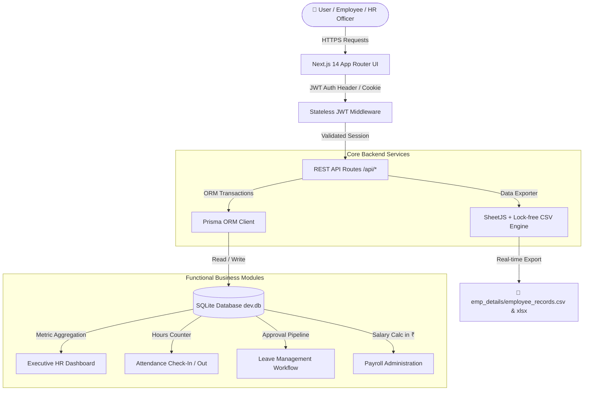

# DayFlow - Enterprise Human Resource Management System (HRMS)

<div align="center">


**Every workday, perfectly aligned.**

[Live Demo App](https://dayflow.vercel.app) • [GitHub Repository](https://github.com/Kavin-124/DayFlow) • [System Architecture](#-system-architecture--workflow)

</div>

---

## 📖 Overview

**DayFlow** is a modern, enterprise-grade Human Resource Management System (HRMS) built with Next.js 14 App Router, TypeScript, Tailwind CSS, and Prisma ORM. Designed for modern organizations, DayFlow digitizes workforce operations, real-time attendance tracking, leave request approval pipelines, profile administration, payroll calculation in Indian Rupees (₹), and automated Excel/CSV data exports.

---

## 🏗️ System Architecture & Workflow



---

## 🖥️ Visual Interface Previews

### 📊 1. Executive HR Operations Dashboard
```text
+-----------------------------------------------------------------------------------------+
|  DayFlow  |  Dashboard  |  Profile  |  Attendance  |  Leaves  |  Payroll    [Admin] 🚪  |
+-----------------------------------------------------------------------------------------+
|                                                                                         |
|   👥 Total Employees    ⏰ Present Today    📅 Pending Leaves    💰 Monthly Payroll      |
|           24                   18                  3                 ₹ 12,40,000        |
|                                                                                         |
|   +---------------------------------------+  +--------------------------------------+   |
|   | ⚡ Quick HR Actions                   |  | 🕒 Attendance Live Status            |   |
|   |  - Add Employee Account              |  |  - Present: 75%                      |   |
|   |  - Review Pending Leave Requests      |  |  - Half Day: 10%                     |   |
|   |  - Edit Monthly Payroll Structure    |  |  - On Leave: 15%                     |   |
|   +---------------------------------------+  +--------------------------------------+   |
+-----------------------------------------------------------------------------------------+
```

### ⏰ 2. Real-Time Attendance Check-In / Check-Out Widget
```text
+-------------------------------------------------------------------+
|  Today's Shift: 22 Aug 2026                                       |
|  Status: 🟢 checked_in (Working: 04h 25m)                        |
|                                                                   |
|  [ 🟢 Check In Now ]           [ 🔴 Check Out Now ]              |
|  Log Time: 09:00 AM            Log Time: -- : --                  |
|                                                                   |
|  Recent Logs:                                                     |
|  - 21 Aug 2026 | Check In: 09:02 AM | Check Out: 05:30 PM | 8.5 hrs |
|  - 20 Aug 2026 | Check In: 09:00 AM | Check Out: 05:15 PM | 8.2 hrs |
+-------------------------------------------------------------------+
```

### 📅 3. Leave Application & Approval Pipeline
```text
+-----------------------------------------------------------------------------------------+
|  Employee Request: MouliTharan (EMP-003)                                                |
|  Type: Sick Leave | Dates: 24 Aug 2026 to 25 Aug 2026 (2 Days)                          |
|  Remarks: "Fever and doctor consultation"                                              |
|  Status: 🟡 PENDING                                                                     |
|                                                                                         |
|  Admin Review: [ ✅ Approve Request ]   [ ❌ Reject Request ]                                |
|  Comments: [ "Approved. Get well soon!"                       ]                         |
+-----------------------------------------------------------------------------------------+
```

### 💰 4. Payroll Structure Breakdown (₹ INR)
```text
+-------------------------------------------------------------------+
|  Employee: Kavin Kumar (EMP-006) | Department: Engineering        |
|  Month: August 2026                                               |
|                                                                   |
|  💵 Basic Salary:      ₹ 50,000.00                                |
|  ➕ HRA & Allowances:  ₹ 12,500.00                                |
|  ➖ Tax & Deductions:  ₹  3,500.00                                |
|  ---------------------------------------------------------------  |
|  💰 NET SALARY:        ₹ 59,000.00 (PAID)                         |
+-------------------------------------------------------------------+
```

---

## 🔑 Demo Credentials

Use the pre-configured administrator account for 1-click testing:

| Role | Email | Password | Access Privileges |
|---|---|---|---|
| 👑 **Admin / HR Officer** | `admin@dayflow.com` | `admin123` | Full Administrative Privileges & Payroll Access |
| 👤 **Employee** | *Register via `/register`* | *Custom* | Self-service Attendance, Leaves, Profile & Payslips |

*(Click the **Demo Admin** banner on the Login page for instant 1-click auto-fill!)*

---

## 🌟 Key Modules & Features

### 🔐 1. Authentication & Role-Based Access Control (RBAC)
- Dual-role security model: **`ADMIN` (HR Officer)** vs **`EMPLOYEE`**.
- Secure JSON Web Token (JWT) stateless auth stored in HttpOnly cookies using `jose`.
- Password encryption using `bcryptjs`.
- Automatic email normalization (`.trim().toLowerCase()`) ensuring seamless re-authentication.

### 👤 2. Employee Profile Management
- Comprehensive profile views (Job Title, Department, Work Email, Joining Date, Base Salary).
- Role-scoped edit permissions:
  - **Employees**: Update phone number, address, and profile avatar.
  - **Admins**: Full management of employee titles, departments, base pay, and account roles.

### ⏰ 3. Attendance Tracking System
- Real-time Check-In and Check-Out widget with live working hours calculation.
- Automated status classification: `PRESENT`, `HALF_DAY`, `ABSENT`, `LEAVE`.
- History log supporting daily & weekly attendance audit views.

### 📅 4. Leave & Time-Off Management Workflow
- Multi-type leave request portal (`PAID`, `SICK`, `UNPAID`).
- Real-time status pipeline: `PENDING` $\rightarrow$ `APPROVED` / `REJECTED`.
- Admin review modal with custom feedback comments.
- **Auto-Sync**: Approving a leave application automatically updates the employee's attendance log for those dates to `LEAVE`.

### 💰 5. Payroll Administration
- **Employee View**: Read-only breakdown of basic salary, allowances, deductions, and net pay in Indian Rupees (₹).
- **Admin View**: Interactive edit modal for basic pay, monthly allowances, and tax deductions with instant net salary recalculation.
- Total organization monthly payroll cost metrics.

### 📊 6. Executive Dashboard & KPI Metrics
- Real-time KPI cards for HR Officers: `Total Employees`, `Present Today`, `Pending Leaves`, `Monthly Payroll Cost`.
- Employee self-service quick actions.

### 📊 7. Real-Time Dual Format Data Export
- Automatic export to `D:\Antigravity\ODOO 2k26\emp_details\`:
  - 📄 **`employee_records.csv`**: Lock-free CSV export updating in real time even when Excel is open.
  - 📊 **`employee_records.xlsx`**: Excel workbook sheet format.

---

## 🛠️ Technology Stack

| Layer | Technologies |
|---|---|
| **Frontend Framework** | [Next.js 14 (App Router)](https://nextjs.org/) + React 18 |
| **Language** | TypeScript |
| **Styling & Icons** | Tailwind CSS + Lucide React Icons |
| **Database & ORM** | SQLite + [Prisma ORM](https://www.prisma.io/) |
| **Authentication** | JWT (`jose`) + `bcryptjs` |
| **Data Export** | SheetJS (`xlsx`) + Native CSV Stream |
| **Hosting & Deployment** | Vercel Serverless Platform |

---

## 🚀 Quick Start Guide

```bash
# 1. Clone Repository
git clone https://github.com/Kavin-124/DayFlow.git
cd DayFlow

# 2. Install Dependencies
npm install

# 3. Initialize Database Schema
npx prisma db push

# 4. Seed Default Admin Account
npm run db:seed

# 5. Start Development Server
npm run dev
```

Open [http://localhost:3000](http://localhost:3000) in your browser.

---

## 📁 Directory Architecture

```
DayFlow/
├── emp_details/             # Real-time CSV & XLSX employee export directory
│   ├── employee_records.csv
│   └── employee_records.xlsx
├── prisma/
│   ├── schema.prisma        # Database models (User, Attendance, LeaveRequest, Payroll)
│   └── dev.db               # SQLite database
├── src/
│   ├── app/                 # Next.js App Router (Pages & REST API Endpoints)
│   │   ├── api/             # API routes (Auth, Attendance, Leaves, Payroll, Users)
│   │   ├── attendance/      # Attendance tracking view
│   │   ├── dashboard/       # Operations dashboard
│   │   ├── leaves/          # Leave management portal
│   │   ├── payroll/         # Payroll administration
│   │   ├── profile/         # Employee profile management
│   │   ├── login/           # Sign-in portal
│   │   └── register/        # Account creation portal
│   ├── components/          # Design system UI & navigation components
│   ├── hooks/               # Custom React hooks (useAuth)
│   └── lib/                 # Database client, JWT helpers, and Excel exporter
├── next.config.js           # Serverless file tracing & Next.js config
├── package.json
└── README.md
```

---

## 📄 License

This project is licensed under the [MIT License](LICENSE).
